# Hedera Key Guardian

> Secure Key Management for Onchain Applications — a serverless backend that signs and submits Hedera transactions using AWS KMS-managed ECDSA secp256k1 keys. The private key never leaves FIPS 140-2 validated HSMs.

## How It Works (Simple Overview)

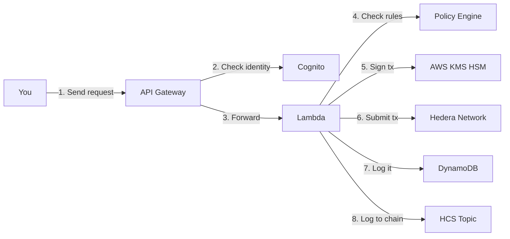

Your private key lives inside AWS KMS hardware. It never comes out. When you want to send HBAR or tokens on Hedera, you call our API. We check your identity (Cognito JWT), enforce policy rules (amount limits, recipient allowlists), then ask KMS hardware to sign the transaction. The signed transaction goes to Hedera. Everything is logged.

## Documentation

Detailed docs are in the [`docs/`](docs/) folder:

| Document | Description |
|----------|-------------|
| [`docs/architecture.md`](docs/architecture.md) | Full architecture deep-dive with diagrams |
| [`docs/threat-model.md`](docs/threat-model.md) | Threat model and security controls |
| [`docs/openapi.yaml`](docs/openapi.yaml) | OpenAPI 3.0 spec (also served at `GET /docs`) |

## The Problem

Private key management is the single biggest security risk in blockchain applications. Most key management solutions are chain-agnostic wrappers that don't understand the signing conventions of specific networks.

Hedera's ECDSA secp256k1 signing has a specific requirement: the SDK uses **keccak256** (not SHA-256) for hashing transaction bodies before signing. Generic KMS integrations miss this, producing invalid signatures.

This project solves that by bridging AWS KMS and Hedera's signing conventions correctly, with a production-grade policy engine and audit trail on top.

## System Architecture

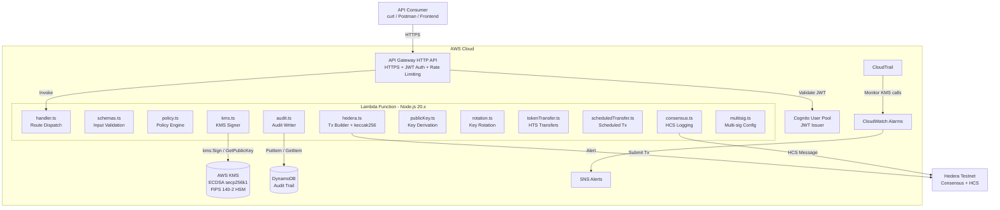


## Transaction Signing Flow

This is the core innovation — how a transaction goes from API request to Hedera consensus:

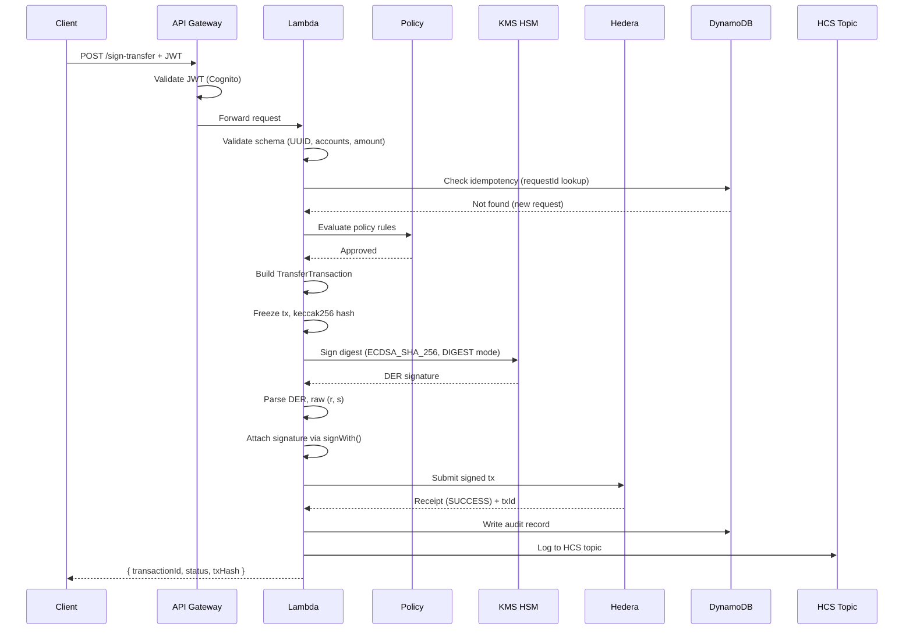

## Key Innovation: keccak256 + KMS Bridge

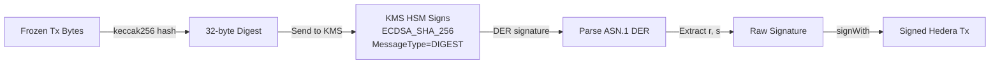

The Hedera SDK uses **keccak256** for ECDSA signing, not SHA-256. AWS KMS `ECDSA_SHA_256` expects a pre-hashed digest. We hash with keccak256 locally, then send the 32-byte digest to KMS with `MessageType=DIGEST`. KMS signs it without re-hashing. This is a non-obvious integration that most KMS-to-blockchain projects get wrong.

## Policy Engine

The policy engine evaluates every request BEFORE KMS is invoked. The key literally cannot sign what the policy rejects.

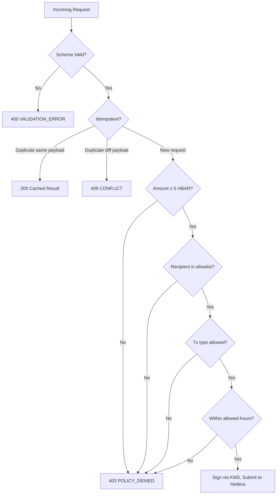

## Security Layers

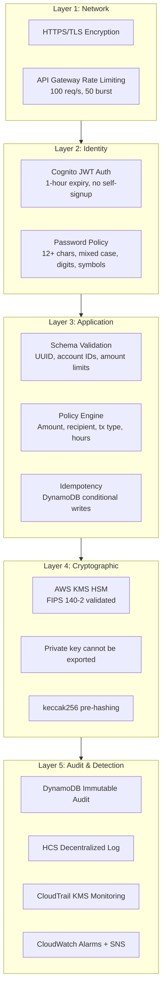

## Token Transfer Flow (HTS)

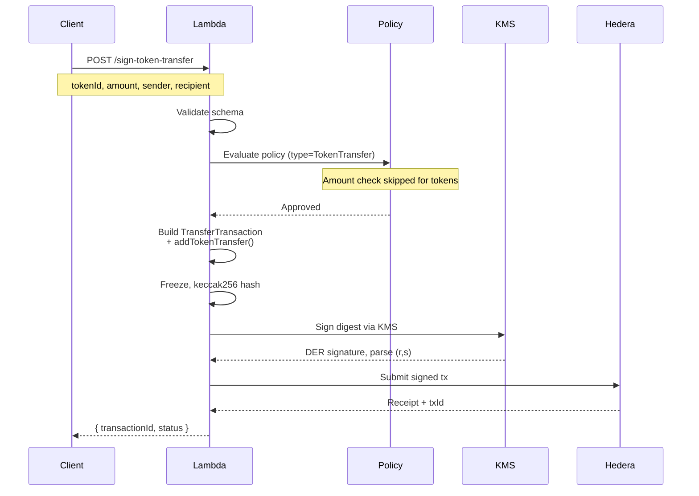

## Why This Needs to Be On-Chain

A traditional Web2 approach would store signing keys in a database. This creates a single point of compromise. By anchoring signing to AWS KMS hardware and submitting transactions directly to Hedera's consensus layer:

- The private key **physically cannot be extracted** from KMS hardware
- Every transaction is **verified by Hedera consensus nodes**
- The **immutable audit trail** (DynamoDB + HCS + CloudTrail) provides cryptographic proof of every signing decision
- **Policy enforcement happens before signing** — the key can't be used outside the rules

## API Endpoints

| Method | Path | Auth | Description |
|--------|------|------|-------------|
| `POST` | `/sign-transfer` | JWT | Sign and submit an HBAR transfer |
| `POST` | `/sign-token-transfer` | JWT | Sign and submit an HTS token transfer |
| `POST` | `/schedule-transfer` | JWT | Schedule a transfer for future execution |
| `GET` | `/public-key` | JWT | Get KMS public key (DER, compressed, EVM address) |
| `POST` | `/rotate-key` | JWT | Rotate the signing key |
| `GET` | `/multisig-config` | JWT | View multi-sig / threshold key configuration |
| `POST` | `/create-audit-topic` | JWT | Create an HCS topic for audit logging |
| `GET` | `/docs` | None | OpenAPI 3.0 spec |


## Key Rotation Flow

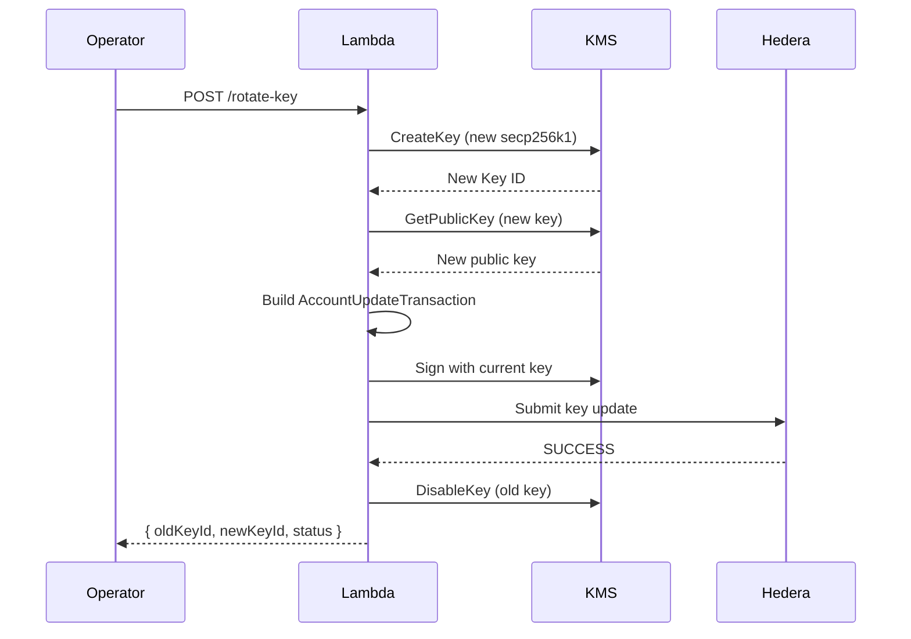

## Multi-Signature Support

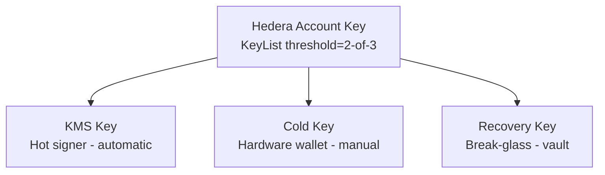

Configure via environment variables:
```bash
MULTISIG_ENABLED=true
MULTISIG_THRESHOLD=2
MULTISIG_KEYS=kms:<kmsKeyId>:Primary,manual:<coldPubKeyHex>:ColdKey,manual:<recoveryPubKeyHex>:Recovery
```

## Scheduled Transactions

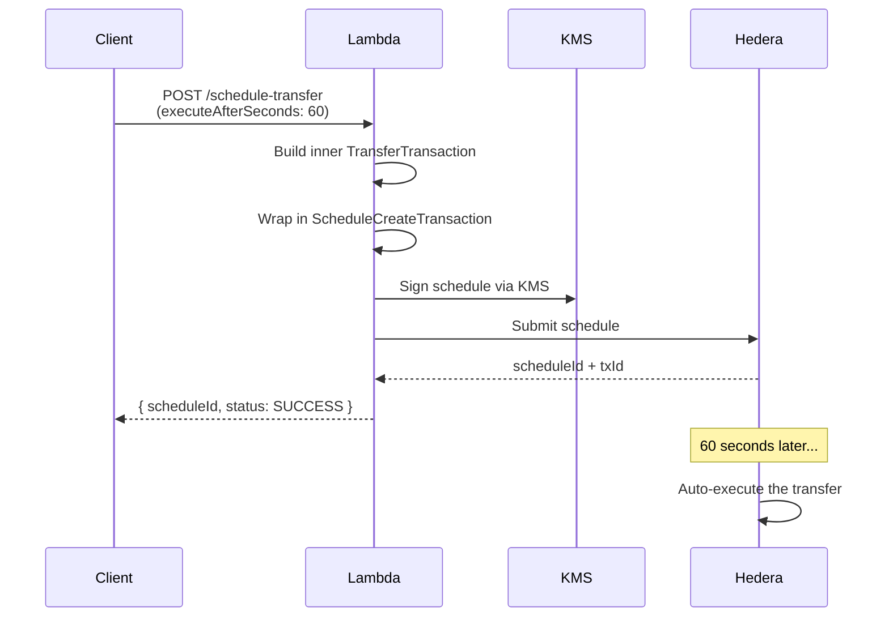

## HCS Consensus Audit Logging

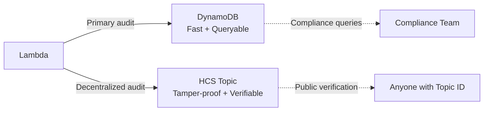

Every signing decision is logged to both DynamoDB (fast, queryable) and Hedera Consensus Service (tamper-proof, decentralized). HCS messages contain: event type, requestId, status, timestamp, transactionId, and policy violations.

## Monitoring & Security

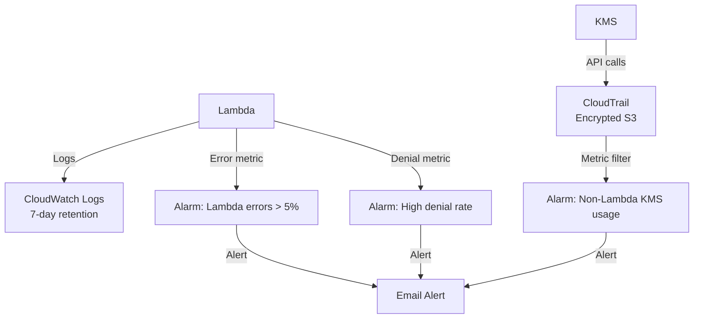

Three CloudWatch alarms protect the system:
1. Non-Lambda KMS usage (someone else trying to use the signing key)
2. Lambda error rate > 5% in 5 minutes
3. High denial rate > 10 in 5 minutes (possible attack)

## Quick Start

### Prerequisites
- Node.js 20+, AWS CLI v2, AWS CDK CLI
- A Hedera testnet account ([portal.hedera.com](https://portal.hedera.com))

### 1. Install & Deploy
```bash
cd hedera-kms-signer && npm install
cd infra && npm install
npx cdk deploy -c hederaNetwork=testnet -c hederaOperatorId=0.0.YOUR_ACCOUNT -c alertEmail=you@example.com
```

### 2. Create Cognito User
```bash
aws cognito-idp admin-create-user --user-pool-id <POOL_ID> --username you@example.com \
  --temporary-password 'TempPass123!' \
  --user-attributes Name=email,Value=you@example.com Name=email_verified,Value=true
```

### 3. Link Hedera Account to KMS Key
```bash
# Get the KMS public key
curl -H "Authorization: Bearer $TOKEN" $API_ENDPOINT/public-key
# Update your Hedera account's key to the publicKeyCompressed value
```

### 4. Test a Transfer
```bash
curl -X POST "$API_ENDPOINT/sign-transfer" \
  -H "Authorization: Bearer $TOKEN" -H "Content-Type: application/json" \
  -d '{"requestId":"'$(uuidgen | tr A-Z a-z)'","senderAccountId":"0.0.YOUR_ACCOUNT","recipientAccountId":"0.0.1234","amountHbar":1}'
```

### 5. Run the Demo
```bash
chmod +x demo.sh && ./demo.sh
```

Interactive 13-step demo covering all endpoints with verification links.

### 6. Run Automated Tests
```bash
# Unit tests (143 tests, 13 files)
npm test

# E2E endpoint tests (22 checks against live API)
bash test-endpoints.sh
```


## Design Decisions

| Decision | Rationale |
|----------|-----------|
| AWS KMS `ECC_SECG_P256K1` | Only cloud KMS that supports secp256k1 natively |
| keccak256 pre-hashing | Hedera SDK uses keccak256 for ECDSA, not SHA-256 |
| Single Lambda, multiple routes | Simpler deployment, shared KMS connection pool |
| DynamoDB conditional writes | `attribute_not_exists` prevents audit tampering |
| Cognito JWT (not API keys) | Standard OAuth2 flow, token expiry, no shared secrets |
| CDK (not SAM/Terraform) | Type-safe infrastructure, single `npx cdk deploy` |
| Policy engine in Lambda | Evaluated before KMS — key can't sign what policy rejects |

## Project Structure

```
hedera-kms-signer/
├── src/
│   ├── handler.ts           # Lambda entry point, route dispatch
│   ├── schemas.ts           # Request validation
│   ├── policy.ts            # Policy engine (amount, recipient, hours, tx type)
│   ├── hedera.ts            # Transaction builder + keccak256 + KMS signing
│   ├── tokenTransfer.ts     # HTS token transfer builder
│   ├── scheduledTransfer.ts # Scheduled transaction builder
│   ├── consensus.ts         # HCS consensus event logging
│   ├── kms.ts               # KMS Sign/GetPublicKey + DER parsing
│   ├── audit.ts             # DynamoDB audit trail (immutable writes)
│   ├── publicKey.ts         # Public key derivation
│   ├── rotation.ts          # Key rotation orchestration
│   ├── multisig.ts          # Multi-sig / threshold key config
│   └── __tests__/           # 143 unit + property-based tests
├── docs/
│   ├── architecture.md      # Architecture deep-dive with diagrams
│   ├── threat-model.md      # Threat model and security controls
│   └── openapi.yaml         # OpenAPI 3.0 spec
├── infra/
│   └── lib/hedera-kms-signer-stack.ts  # CDK stack
├── demo.sh                  # Interactive 13-step demo
├── test-endpoints.sh        # Automated E2E tests (22 checks)
└── .env                     # Deployed stack outputs (local only)
```

## Ecosystem Impact

- **Lowers the barrier for enterprise Hedera adoption** — enterprises already use AWS KMS
- **Solves a real integration gap** — the keccak256 signing discovery saves future developers from `INVALID_SIGNATURE` debugging
- **Provides a reference architecture** — policy-before-sign, immutable audit, CloudTrail monitoring are reusable patterns
- **Enables custodial services** — exchanges and wallets can manage Hedera accounts without holding private keys

## Tech Stack

| Component | Technology |
|-----------|-----------|
| Runtime | Node.js 20.x (Lambda) |
| Language | TypeScript (ESM) |
| Infrastructure | AWS CDK (TypeScript) |
| Signing | AWS KMS `ECC_SECG_P256K1` |
| Auth | Amazon Cognito (JWT) |
| Audit | DynamoDB + HCS |
| API | API Gateway HTTP API |
| Monitoring | CloudWatch + CloudTrail + SNS |
| Blockchain | Hedera SDK v2.81.0 |
| Testing | Vitest + fast-check (property-based) |

## Future Roadmap

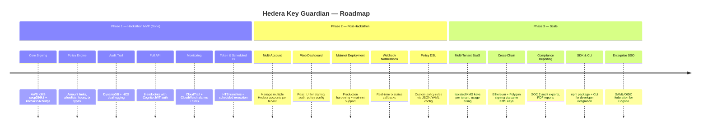

### Go-To-Market Strategy

| Phase | Timeline | Focus | Target Users |
|-------|----------|-------|-------------|
| Phase 1 | Hackathon | Working MVP with full docs | Judges, Hedera devs |
| Phase 2 | 1–3 months | Dashboard + mainnet + multi-account | Early adopters, startups |
| Phase 3 | 3–6 months | Multi-tenant SaaS + cross-chain | Enterprises, exchanges, custodians |

**Phase 1 (Now):** Open-source reference architecture. Developers can fork and deploy in minutes with `npx cdk deploy`. Full test coverage (143 unit tests + 22 E2E tests) and interactive demo.

**Phase 2 (Next):** Add a web dashboard so non-CLI users can manage signing policies, view audit logs, and trigger transactions. Deploy to Hedera mainnet with production-grade monitoring.

**Phase 3 (Scale):** Multi-tenant SaaS where each customer gets isolated KMS keys, DynamoDB tables, and policy configs. Expand to Ethereum/Polygon signing (same secp256k1 keys work). Enterprise compliance features for regulated industries.

## Live on Testnet

- Account: [`0.0.8291501`](https://hashscan.io/testnet/account/0.0.8291501)
- HCS Audit Topic: [`0.0.8310543`](https://hashscan.io/testnet/topic/0.0.8310543)
- API Docs: `GET /docs` (public, no auth)

## License

MIT
