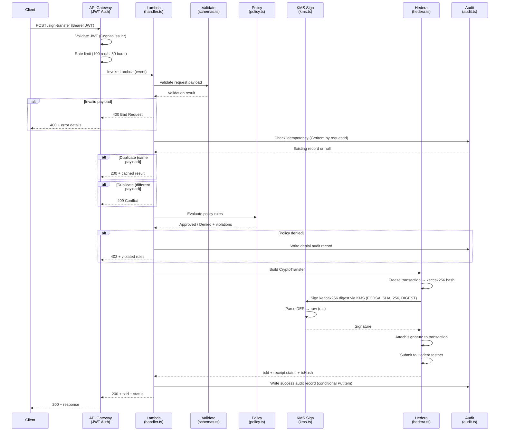
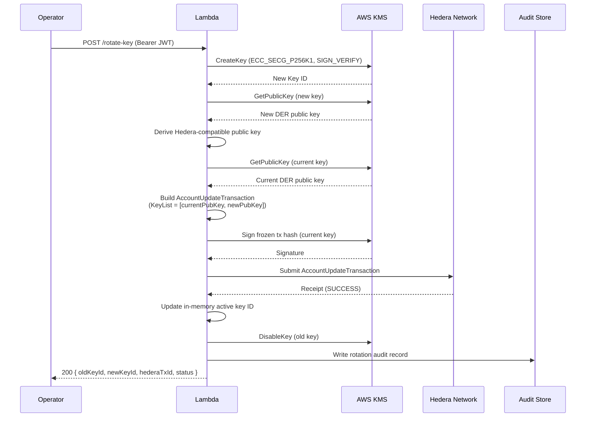
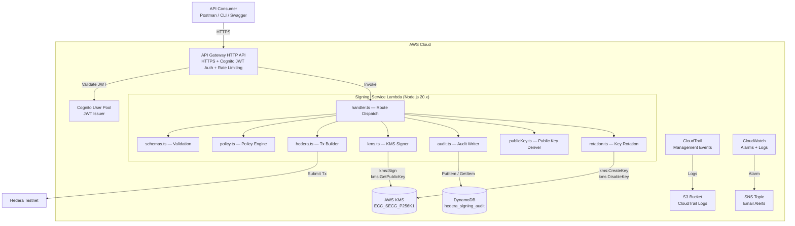

# Architecture — Hedera KMS Signing Backend

## Overview

This document describes the architecture of the Hedera KMS Signing Backend, a serverless system on AWS that signs and submits Hedera transactions using AWS KMS-managed ECDSA secp256k1 keys. The private key never leaves KMS hardware security modules.

**Validates: Requirements 14.5, 14.6**

---

## 1. Key Management Architecture

### KMS Key Lifecycle

The signing key is an AWS KMS asymmetric key with the following properties:

| Property | Value |
|----------|-------|
| Key Spec | `ECC_SECG_P256K1` (secp256k1 elliptic curve) |
| Key Usage | `SIGN_VERIFY` |
| Alias | `alias/hedera-signer-dev` |
| Removal Policy | `RETAIN` (key persists on stack deletion) |

Lifecycle stages:

1. **Provisioned** — CDK creates the KMS key during `cdk deploy`. The key is immediately active.
2. **Active** — Lambda uses the key for `kms:Sign` and `kms:GetPublicKey` operations. The key ID is passed via the `KMS_KEY_ID` environment variable.
3. **Rotated** — When `POST /rotate-key` is called, a new key is created and the Hedera account key list is updated. The old key is disabled after a grace period.
4. **Disabled** — The old key is disabled via `kms:DisableKey`. It can be re-enabled if needed but is no longer used for signing.

### Signing Flow

1. The Lambda function receives a validated, policy-approved signing request.
2. A `TransferTransaction` is constructed using the Hedera SDK and frozen to produce deterministic bytes.
3. The frozen transaction body bytes are hashed with **keccak256** (matching the Hedera SDK's ECDSA signing convention — the SDK uses keccak256, not SHA-256, for secp256k1 signatures).
4. The keccak256 digest is sent to KMS via `kms:Sign` with the `ECDSA_SHA_256` algorithm and `MessageType=DIGEST` (KMS signs the pre-hashed digest directly without re-hashing).
5. KMS returns a DER-encoded signature. The Lambda parses the ASN.1 DER structure to extract raw `(r, s)` components as 32-byte big-endian unsigned integers.
6. The `(r, s)` signature is attached to the frozen transaction using `signWith()` with the KMS-derived public key.
7. The signed transaction is submitted to the Hedera network.

### Public Key Derivation

The KMS public key is retrieved via `kms:GetPublicKey` and cached in-memory for the Lambda execution context. From the DER/SPKI-encoded key, the system derives:

- **Uncompressed public key** (65 bytes): `04 || x || y`
- **Compressed public key** (33 bytes): `02`/`03` prefix (based on y-coordinate parity) `|| x`
- **EVM address**: last 20 bytes of `keccak256(x || y)`, prefixed with `0x`

The compressed public key is used for Hedera account identification. The EVM address is used for funding and alias-compatible flows.

---

## 2. Data Flow Diagrams

### Signing Flow



### Key Rotation Flow



---

## 3. High-Level Architecture



---

## 4. Hedera Integration

### Account Setup

The system uses a single Hedera account as both the transaction signer and payer. For MVP:

1. Create a Hedera testnet account at [portal.hedera.com](https://portal.hedera.com).
2. Deploy the CDK stack to provision the KMS key.
3. Call `GET /public-key` to retrieve the KMS-derived compressed public key and EVM address.
4. Update the Hedera account's key to the KMS-derived public key using the Hedera portal or SDK, so that KMS-signed transactions are accepted by the network.
5. Fund the account with testnet HBAR via the Hedera faucet.
6. Set `HEDERA_OPERATOR_ID` in the CDK context to the account ID (e.g., `0.0.8291501`).

### Transaction Signing

The signing flow for a `CryptoTransfer`:

1. `hedera.ts` constructs a `TransferTransaction` using the Hedera SDK with sender, recipient, amount, and optional memo.
2. `transactionValidDuration` is set to 120 seconds. Node account IDs are selected from the configured Hedera network.
3. The transaction is frozen, producing deterministic serialized bytes.
4. The frozen body bytes are hashed with keccak256 (the Hedera SDK's ECDSA signing convention uses keccak256, not SHA-256).
5. `kms.ts` sends the keccak256 digest to KMS for signing with `ECDSA_SHA_256` and `MessageType=DIGEST`. On failure, it retries up to 2 times with exponential backoff (200ms, 400ms).
6. The DER-encoded signature from KMS is parsed to extract raw `(r, s)` values.
7. The signature is attached to the frozen transaction using `signWith()` with the KMS-derived public key.

### Submission Flow

1. The signed transaction is submitted via `Transaction.execute()` on the configured Hedera client (testnet by default).
2. The system waits for a receipt with a 30-second timeout.
3. On success, the transaction ID, receipt status, and transaction hash are returned.
4. On failure or timeout, the error is returned to the caller and recorded in the audit trail.
5. The sender account must match `HEDERA_OPERATOR_ID` — the system rejects requests where the sender differs from the operator account.

---

## 5. Key Rotation Process

> Phase 2 / Stretch — Key rotation is implemented for completeness but is not part of the MVP critical path.

AWS KMS automatic key rotation applies only to symmetric keys. Since the signing key uses `ECC_SECG_P256K1` (asymmetric), rotation is performed manually.

### Via API Endpoint

Send an authenticated `POST /rotate-key` request. The endpoint orchestrates:

1. **Create new KMS key** — `ECC_SECG_P256K1`, `SIGN_VERIFY` usage.
2. **Retrieve new public key** — `kms:GetPublicKey` on the new key; derive Hedera-compatible compressed form.
3. **Update Hedera account** — Submit an `AccountUpdateTransaction` that sets the account key to a `KeyList` containing both the current and new public keys, signed by the current active key.
4. **Switch active key** — Update the in-memory key reference so subsequent signing uses the new key.
5. **Disable old key** — Call `kms:DisableKey` on the previous key.
6. **Audit** — Write a rotation audit record with old key ID, new key ID, Hedera transaction ID, and timestamp.

If any step fails, the rotation halts, the current key remains active, and a failure audit record is written.

### Manual Steps (CLI)

If the API endpoint is unavailable, rotation can be performed manually:

```bash
# 1. Create a new KMS key
aws kms create-key --key-spec ECC_SECG_P256K1 --key-usage SIGN_VERIFY \
  --description "Hedera signing key (rotated $(date -u +%Y-%m-%dT%H:%M:%SZ))"

# 2. Get the new key's public key
aws kms get-public-key --key-id <NEW_KEY_ID> --output text --query PublicKey | base64 -d > new-pubkey.der

# 3. Derive the Hedera-compatible public key from the DER output
#    (use the GET /public-key endpoint or a script to convert DER → compressed secp256k1)

# 4. Update the Hedera account key list using the Hedera SDK or portal
#    to include both the current and new public keys

# 5. Update the CDK context or Lambda environment variable to use the new key ID
#    Then redeploy: cd infra && npx cdk deploy -c hederaOperatorId=0.0.XXXX

# 6. Disable the old key after confirming the new key works
aws kms disable-key --key-id <OLD_KEY_ID>
```

---

## 6. Security Controls Summary

| Control | Description | Threats Mitigated |
|---------|-------------|-------------------|
| KMS Key Policy | `kms:Sign` and `kms:GetPublicKey` restricted to Lambda role; `SIGN_VERIFY` usage only; no export | T1, T2 |
| Least-Privilege IAM | Lambda role scoped to specific KMS key ARN and DynamoDB table ARN; no wildcards for data operations | T1, T7 |
| Conditional DynamoDB Writes | `attribute_not_exists(pk) AND attribute_not_exists(sk)` prevents audit record overwrites; no delete/update permissions | T4, T5 |
| CloudTrail Monitoring | Dedicated trail logs all KMS and management API calls to encrypted S3 bucket | T1, T5 |
| CloudWatch Alarms | Alerts on non-Lambda KMS usage, high denial rates (>10/5min), Lambda error rate (>5%/5min) | T1, T6 |
| Idempotency Checks | `requestId` + `payloadHash` prevent duplicate processing; different payload → 409 Conflict | T4 |
| Rate Limiting | API Gateway throttling: 100 req/s rate, 50-request burst | T6 |
| Key Rotation | `POST /rotate-key` creates new key, updates Hedera account, disables old key | T2 |
| Cognito JWT Auth | JWT bearer token validated against Cognito User Pool; self-signup disabled; strong password policy | T6 |
| Policy Engine | Configurable rules: amount limit, recipient allowlist, tx type allowlist, time-of-day restriction | T3, T6 |
| TLS/HTTPS Only | API Gateway enforces encrypted transport | T3, T6 |
| Freeze-Before-Sign | Transactions frozen to deterministic bytes before signing; hash stored in audit | T3 |
| SNS Alert Notifications | CloudWatch alarm actions notify operators via email | T1, T6 |

---

## 7. Deployment Instructions

### Prerequisites

- **Node.js 20.x** — Lambda runtime and local development
- **AWS CLI v2** — configured with credentials for the target account (`aws configure`)
- **AWS CDK CLI** — install globally: `npm install -g aws-cdk`
- **Hedera testnet account** — create at [portal.hedera.com](https://portal.hedera.com) and fund via faucet

### CDK Deploy

The infrastructure is defined in `infra/lib/hedera-kms-signer-stack.ts` using AWS CDK.

```bash
# 1. Install dependencies
cd hedera-kms-signer/infra
npm install

# 2. Bootstrap CDK (first time only)
npx cdk bootstrap

# 3. Deploy the stack with context parameters
npx cdk deploy \
  -c hederaNetwork=testnet \
  -c hederaOperatorId=0.0.8291501 \
  -c alertEmail=your-email@example.com
```

The deploy provisions:
- KMS asymmetric key (`ECC_SECG_P256K1`)
- DynamoDB audit table (`hedera_signing_audit`)
- Lambda function (Node.js 20.x, esbuild bundled)
- API Gateway HTTP API with Cognito JWT authorizer
- Cognito User Pool and client
- CloudTrail trail with S3 bucket
- CloudWatch alarms and SNS topic
- IAM roles with least-privilege policies

### Environment Variables

The Lambda function receives these environment variables from the CDK stack:

| Variable | Description | Example |
|----------|-------------|---------|
| `KMS_KEY_ID` | KMS signing key ID (set automatically by CDK) | `a1b2c3d4-...` |
| `AUDIT_TABLE_NAME` | DynamoDB audit table name | `hedera_signing_audit` |
| `HEDERA_NETWORK` | Hedera network target | `testnet` |
| `HEDERA_OPERATOR_ID` | Hedera operator account ID | `0.0.8291501` |
| `POLICY_MAX_AMOUNT_HBAR` | Max transfer amount in HBAR | `5` |
| `POLICY_ALLOWED_RECIPIENTS` | Comma-separated allowed recipient accounts | `0.0.1234,0.0.5678` |
| `POLICY_ALLOWED_TRANSACTION_TYPES` | Comma-separated allowed transaction types | `CryptoTransfer` |
| `POLICY_ALLOWED_HOURS_START` | Allowed hours start (UTC, 0-23) | `8` |
| `POLICY_ALLOWED_HOURS_END` | Allowed hours end (UTC, 0-23) | `22` |

### Initial Setup

After deploying the stack:

1. **Create a Cognito user** (self-signup is disabled):

   ```bash
   # Get the User Pool ID from CDK outputs
   USER_POOL_ID=<UserPoolId from cdk deploy output>

   aws cognito-idp admin-create-user \
     --user-pool-id $USER_POOL_ID \
     --username your-email@example.com \
     --temporary-password 'TempPass123!@#' \
     --user-attributes Name=email,Value=your-email@example.com Name=email_verified,Value=true
   ```

2. **Authenticate and get a JWT token**:

   ```bash
   CLIENT_ID=<UserPoolClientId from cdk deploy output>

   # Initial auth (will require password change)
   aws cognito-idp initiate-auth \
     --client-id $CLIENT_ID \
     --auth-flow USER_PASSWORD_AUTH \
     --auth-parameters USERNAME=your-email@example.com,PASSWORD='TempPass123!@#'

   # Complete the NEW_PASSWORD_REQUIRED challenge
   aws cognito-idp respond-to-auth-challenge \
     --client-id $CLIENT_ID \
     --challenge-name NEW_PASSWORD_REQUIRED \
     --session <session from previous response> \
     --challenge-responses USERNAME=your-email@example.com,NEW_PASSWORD='YourSecurePass123!@#'
   ```

3. **Retrieve the KMS public key**:

   ```bash
   API_URL=<ApiEndpoint from cdk deploy output>
   TOKEN=<IdToken from auth response>

   curl -H "Authorization: Bearer $TOKEN" $API_URL/public-key
   ```

4. **Set up the Hedera account**: Update the Hedera account's key to the KMS-derived compressed public key returned by `/public-key`. This can be done via the Hedera portal or using the Hedera SDK. Fund the account with testnet HBAR via the faucet.

5. **Test a signing request**:

   ```bash
   curl -X POST "$API_URL/sign-transfer" \
     -H "Authorization: Bearer $TOKEN" \
     -H "Content-Type: application/json" \
     -d '{
       "requestId": "550e8400-e29b-41d4-a716-446655440000",
       "senderAccountId": "0.0.8291501",
       "recipientAccountId": "0.0.1234",
       "amountHbar": 1,
       "memo": "Test transfer"
     }'
   ```

### API Endpoints

| Method | Path | Auth | Description |
|--------|------|------|-------------|
| `POST` | `/sign-transfer` | JWT | Submit a CryptoTransfer signing request |
| `GET` | `/public-key` | JWT | Retrieve KMS public key info |
| `GET` | `/docs` | None | Serve OpenAPI 3.0 specification |
| `POST` | `/rotate-key` | JWT | Initiate signing key rotation |
